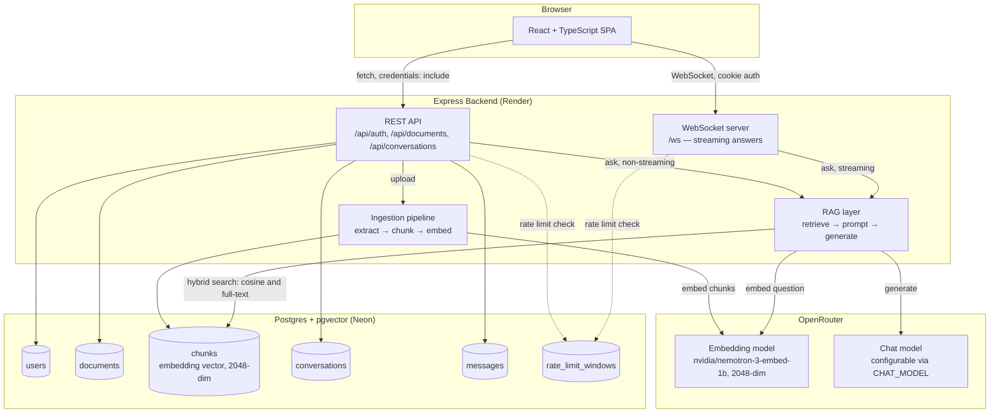

# DocuQuery — RAG Document Q&A

A full-stack Retrieval-Augmented Generation system for document question
answering. Users upload a PDF and ask natural-language questions about it;
answers are generated strictly from the document's content, with inline
citations to the source page, and an explicit refusal instead of a guess
when the document does not contain the answer.

**Stack:** React + TypeScript frontend, Node.js/Express backend, PostgreSQL
with the pgvector extension for both relational data and embeddings, JWT
authentication over httpOnly cookies, WebSocket-based streaming responses.

## Table of contents

- [Architecture](#architecture)
- [Design decisions](#design-decisions)
- [Local development](#local-development)
- [Deployment](#deployment)
- [Testing](#testing)
- [Evaluation](#evaluation)
- [Security](#security)
- [Scaling considerations](#scaling-considerations)
- [Project structure](#project-structure)

## Architecture



**Request flow:**

1. **Upload.** The PDF is written to per-user storage and a `documents` row
   is created with `status: pending`; the upload request returns
   immediately. Extraction, chunking, and embedding run asynchronously
   (`backend/src/pipeline/`); the frontend polls document status until it
   reaches `ready`.
2. **Retrieval.** The question is embedded and matched against the
   document's chunks using hybrid search: cosine distance (pgvector's
   `<=>` operator) combined with a PostgreSQL full-text match, fused by
   reciprocal rank. A chunk is treated as relevant if either method
   surfaces it. If no chunk clears the relevance threshold, the language
   model is not called and the fallback message is returned directly.
3. **Generation.** Relevant chunks are numbered and inserted into a system
   prompt that instructs the model to answer only from the given
   excerpts, cite each fact with a `[n]` marker, and return a fixed
   sentinel token (`NOT_FOUND_IN_DOCUMENT`) if the excerpts do not answer
   the question. The REST endpoint calls this synchronously; the
   WebSocket endpoint streams tokens as they are generated and resolves
   citations once the full response has been received, since a citation
   marker can be split across two streamed chunks.
4. **Persistence.** The question and answer are stored in `messages`,
   including `cited_chunk_ids`, so citations can be replayed when a
   conversation is reloaded.

## Design decisions

### PostgreSQL + pgvector instead of a dedicated vector database

A single database is used for both relational data and vector embeddings,
rather than pairing Postgres with a dedicated vector store (Pinecone,
Qdrant, Weaviate, etc.).

**Rationale.** One connection pool, one migration history, one
backup/restore process, and the ability for a document row and its chunks
to commit within the same transaction. At this project's scale — document
counts in the tens to low hundreds per user, not a multi-tenant system
serving millions of vectors — pgvector's exact and approximate search
methods are comfortably fast enough, and the operational simplicity of a
single database outweighs the additional query throughput a dedicated
vector store would provide.

**Where a dedicated vector database would be preferable:** independent
horizontal scaling of vector search from the relational workload, more
advanced approximate nearest-neighbor index tuning, and native multi-vector
or hybrid-search capabilities that this project approximates via Postgres
full-text search rather than provides natively. If document or user counts
grew by one to three orders of magnitude, or vector search latency became
a bottleneck under concurrent load, this would be the point to reconsider.
Because the retrieval layer is isolated behind a single function
(`retrieveChunks.ts`), such a change would be a swap rather than a rewrite.

**Current limitation.** No HNSW or IVFFlat index exists on
`chunks.embedding`; vector search is currently an exact sequential scan.
This is acceptable at the project's current chunk-count scale and is more
accurate than an approximate index at this size, but is the first change
required if chunk counts grow significantly.

### OpenRouter for embeddings and chat completion

A single API key and OpenAI-compatible SDK are used for both embedding
generation and chat completion, with the embedding and chat models each
configurable independently via environment variables. The tradeoff is an
additional proxy hop and rate limits layered on top of the underlying
provider's own limits, which is one reason this project also implements
its own application-level rate limiting rather than relying solely on
upstream limits (see [Security](#security)).

OpenRouter does not support streaming for embedding requests, only for
chat completion. Accordingly, the embedding step
(`pipeline/embedChunks.ts`) is a single blocking batch call per document,
while only the answer-generation call (`rag/generateAnswer.ts`) streams
token by token.

### Hybrid search rather than vector search alone

Embedding similarity search alone can miss exact keyword or proper-noun
matches — a chunk containing a specific identifier or named policy can
rank below a chunk that is more semantically similar but less relevant.
`retrieveChunks.ts` runs a cosine-distance vector search and a PostgreSQL
full-text search (`tsvector` / `plainto_tsquery`) in parallel and fuses the
two ranked lists via reciprocal rank fusion, so a chunk strongly supported
by either method survives the relevance filter.

### WebSocket streaming rather than Server-Sent Events

Server-Sent Events would have been sufficient for this project's
one-directional token stream and were considered as an alternative.
WebSocket was chosen to implement full-duplex, stateful connection
handling end to end: a cookie-authenticated upgrade handshake, per-message
ownership validation, and client-side reconnection. The corresponding cost
is that reconnection logic has to be implemented explicitly — `EventSource`
provides automatic reconnection for SSE; WebSocket does not — which is why
`frontend/src/hooks/useChatSocket.ts` implements a bounded single-retry
reconnect.

### httpOnly cookie authentication rather than a token in localStorage

A JWT stored in `localStorage` is readable by any script running on the
page, so a single XSS vulnerability anywhere in the frontend's dependency
tree is sufficient to exfiltrate every logged-in user's session. An
httpOnly cookie is not accessible to JavaScript at all; the corresponding
tradeoff is CSRF exposure, addressed here via `SameSite` cookie policy and
CORS restricted to an exact origin rather than a wildcard.

Because the frontend (Vercel) and backend (Render) are different origins
in production, the cookie requires `SameSite=None; Secure`, which in turn
requires HTTPS on both sides — both deployment targets provide this by
default. Local development uses `SameSite=Lax` instead (see
`backend/src/lib/auth.ts`).

### Postgres-backed rate limiting rather than Redis

Consistent with the database decision above, rate limiting is implemented
as a fixed-window counter using a single atomic
`INSERT ... ON CONFLICT DO UPDATE ... RETURNING` statement
(`backend/src/lib/rateLimiter.ts`), requiring no additional infrastructure.
The known limitation of a fixed window — up to twice the stated limit if
requests cluster across a window boundary — is an accepted tradeoff for
this project's purpose, which is to guard against accidental overuse of
free-tier LLM quota rather than to enforce precise limits under adversarial
load. A sliding-window or token-bucket scheme, typically Redis-backed,
would be the appropriate upgrade if stricter guarantees were required.

## Local development

### Option A — Docker Compose (recommended)

```bash
cp backend/.env.example backend/.env
# Fill in OPENROUTER_API_KEY, CHAT_MODEL, and JWT_SECRET (openssl rand -base64 48).
# DATABASE_URL and CORS_ORIGIN are overridden by docker-compose.yml for
# local use and do not need to be set in backend/.env for this option.

docker compose up --build
# Backend on :4000, Postgres with pgvector on :5432, migrations run automatically.
```

```bash
cd frontend
npm install
npm run dev
# :5173, proxies /api and /ws to the backend container.
```

### Option B — running natively, without Docker

Requires a local PostgreSQL instance with the `vector` extension available
(for example, `postgresql-16-pgvector` on Debian/Ubuntu), or a Neon
connection string used directly instead of a local instance.

```bash
cd backend
cp .env.example .env   # fill in all values, including DATABASE_URL
npm install
npm run db:migrate
npm run dev             # :4000
```

```bash
cd frontend
cp .env.example .env    # VITE_API_URL can remain empty for local development
npm install
npm run dev              # :5173
```

## Deployment

| Component | Target | Notes |
|---|---|---|
| Frontend | Vercel | Root directory `frontend/`, build command `npm run build`, output directory `dist/`. Set `VITE_API_URL` to the deployed backend URL. |
| Backend | Render | `render.yaml` at the repository root is picked up directly via Render's Blueprint deployment. Builds from `backend/Dockerfile`. Secret-bearing env vars are marked `sync: false` and must be set in Render's dashboard. |
| Database | Neon | Free tier, pgvector-enabled, persistent. Run `npm run db:migrate` once against the Neon connection string, or rely on the container's start command to run migrations automatically (see `backend/Dockerfile`). |

After both services are deployed, set the backend's `CORS_ORIGIN` to the
exact frontend origin and the frontend's `VITE_API_URL` to the exact
backend origin. Both values must be exact, with no wildcard and no
trailing slash, for credentialed cross-origin requests and the
cross-origin cookie to function correctly.

## Testing

**Current coverage.** Pure-function unit tests
(`backend/src/**/*.test.ts`, run via `npm test`) cover the chunking
algorithm, prompt construction and citation parsing, and the
authentication library (password hashing, JWT round-trip, cookie policy by
environment) — 25 tests with no database dependency, run on every push via
`.github/workflows/backend-ci.yml`.

**Not yet covered.** Route-level integration tests (for example,
`supertest` against the signup, upload, and ask-question endpoints in
sequence) require a live Postgres instance in CI — a service container
with migrations applied before the test job runs. `supertest` is already a
development dependency in anticipation of this. This is intentionally
scoped out for now to keep CI fast, while the pure-logic layer — where
most defects surfaced during development, particularly citation-parsing
edge cases and chunk-boundary handling — has solid coverage.

**Frontend.** No component tests exist yet; CI treats a clean
`tsc -b && vite build` as its correctness signal. React Testing Library
with Vitest would be the natural addition, starting with the
citation-marker rendering logic in `MessageBubble`, the most complex piece
of frontend code in the project.

## Evaluation

`eval/` contains a retrieval-accuracy evaluation harness:

- `eval/fixtures/aurora-bikes-handbook.pdf` — a generated, fictional
  six-page employee handbook (source: `generate_fixture.py`) with one
  unambiguous fact per page, so that expected page numbers are verifiable
  rather than subjective.
- `eval/fixtures/questions.json` — fifteen questions: twelve the document
  answers, with verified expected page numbers, and three that are
  deliberately unanswerable, including one adversarial question referring
  to a detail the document does not contain, to test resistance to
  extrapolation.
- `eval/run.ts` — creates a temporary user, uploads the fixture, waits for
  processing to complete, asks each question via the REST endpoint, and
  reports two metrics: answerability accuracy (whether the system
  correctly attempted or correctly refused an answer) and citation-page
  accuracy (for answerable questions, whether at least one cited page
  matches a known-correct page).

To run the evaluation against a live backend with a configured
`OPENROUTER_API_KEY`:

```bash
cd eval
npm install
npm run eval                 # defaults to http://localhost:4000
# EVAL_API_BASE=https://your-app.onrender.com npm run eval
```

| Metric | Result |
|---|---|
| Answerability accuracy | 93% (14/15) |
| Citation page accuracy (answerable questions only) | 75% (9/12) |

The full per-question breakdown is written to `eval/results.md` on each
run. Three questions did not score correctly:

- **Two questions received a correct, correctly-sourced answer with no
  citation marker.** In both cases the model drew on the correct excerpt
  but omitted the `[n]` marker specified in the prompt. This reflects
  instruction-following behavior of the configured free-tier chat model
  rather than a retrieval failure — the relevant chunk was retrieved and
  used correctly. A higher-capability chat model, or a system prompt with
  a worked citation example, would likely close this gap.
- **One question required combining two facts from non-adjacent pages**
  (a PTO carryover figure and a parental-leave duration on separate
  pages). Top-k retrieval ranks chunks by similarity to the question as a
  whole, and a compound question referencing two unrelated facts does not
  match either source page as strongly as a single-fact question would;
  as a result, both facts were not retrieved together, and the system
  correctly declined to answer rather than producing a partial or
  incorrect comparison. This is a known limitation of single-pass top-k
  retrieval for multi-hop questions; query decomposition — splitting a
  compound question into sub-questions, retrieving for each separately,
  and combining the results — is the standard mitigation.
- **All three deliberately unanswerable questions were correctly
  refused**, including the adversarial case. For a document Q&A system,
  correctly refusing to answer is a more important signal than citation
  accuracy on questions the document does answer, since an incorrect
  refusal is preferable to a fabricated answer.

This evaluation measures retrieval quality and refusal correctness; it
does not score answer content against ground truth, which would require
either human review or an LLM-as-judge step and is out of scope for this
harness.

## Security

- httpOnly, `SameSite`-scoped cookie authentication with CORS restricted
  to an exact origin (see [Design decisions](#design-decisions)).
- Application-level, Postgres-backed rate limiting on every endpoint that
  calls the language model, enforced identically on the REST and
  WebSocket paths so the limit cannot be bypassed by switching protocols.
- Server-side request validation (Zod) on every request body, independent
  of client-side form validation.
- No refresh-token flow or server-side session store: a session is a
  self-contained JWT valid for seven days. The only revocation mechanism
  is rotating `JWT_SECRET`, which invalidates all sessions simultaneously.
  This is an accepted scope limitation (see `backend/src/lib/auth.ts`).
- An earlier version of the documents API exposed an endpoint that
  accepted a client-supplied storage path, which a later deletion
  endpoint passed directly to a filesystem removal call. Under the
  project's original single-user development configuration this had no
  practical effect; once multi-user authentication was introduced it
  became an arbitrary-file-deletion vector, since any authenticated user
  could register a document referencing an arbitrary server-side path and
  then delete it. The endpoint was unused by the frontend and was removed
  during the authentication implementation.

## Scaling considerations

- Add an HNSW or IVFFlat index on `chunks.embedding` once chunk volume
  exceeds what exact search comfortably handles.
- Replace the fixed-window rate limiter with a Redis-backed token-bucket
  or sliding-window implementation if precise limits under adversarial
  load become necessary, rather than the current goal of guarding against
  accidental quota overuse.
- Move uploaded PDF storage from local disk to object storage (S3-
  compatible or equivalent). The current implementation
  (`backend/src/lib/storage.ts`) is suitable for a single backend instance
  but does not persist across redeploys or scale across multiple
  instances.
- Introduce a proper session/revocation mechanism — short-lived access
  tokens with refresh-token rotation, or a server-side session table —
  so an individual compromised token can be revoked without invalidating
  every user's session.
- Add database-backed integration tests to CI (see [Testing](#testing)).
- Code-split the frontend bundle. The production build currently exceeds
  the default chunk-size warning threshold, driven largely by KaTeX font
  assets loaded eagerly for a math-rendering feature most conversations do
  not use; deferring this via dynamic `import()` would remove that weight
  from the initial load.
- Extend the evaluation harness with LLM-as-judge or human-reviewed
  answer-content scoring, in addition to the current retrieval and
  refusal-correctness metrics.
- Add query decomposition for multi-hop questions, per the evaluation
  results above: a compound question requiring facts from non-adjacent
  sections is not reliably served by single-pass top-k retrieval.
- Evaluate citation-marker reliability across chat models, and consider a
  worked citation example in the system prompt, per the evaluation
  results above.

## Project structure

```
backend/
  src/
    routes/          REST routes (auth, documents, conversations)
    ws/              WebSocket server (streaming chat)
    pipeline/        PDF extraction, chunking, embedding
    rag/             retrieval, prompt construction, citation parsing, generation
    lib/             auth, rate limiting, OpenRouter client, file storage
    middleware/      JWT authentication
    db/              Drizzle schema and migrations
  Dockerfile
frontend/
  src/
    components/      Sidebar, ChatPanel, MessageBubble, AuthScreen, ...
    hooks/           useAuth, useChatSocket
    api/             typed fetch client
eval/
  fixtures/          fixture PDF and ground-truth questions
  run.ts             evaluation harness
docker-compose.yml   local development: pgvector Postgres + backend
render.yaml          Render Blueprint for backend deployment
.github/workflows/   CI: lint, typecheck, test/build, per package
```